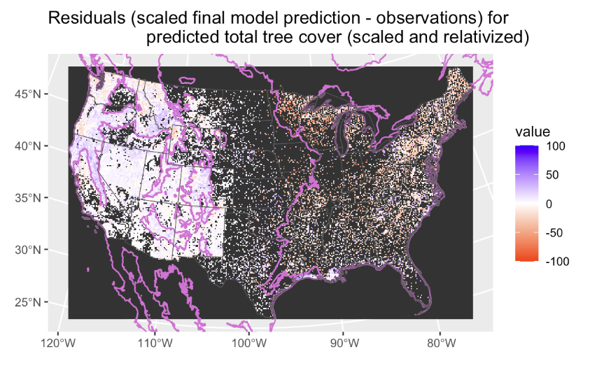

 
This document contains figures to explore the underlying relationships between biomass and cover in the data we're using to fit biomass models.  


```{r}
# Set user defined parameters
knitr::opts_chunk$set(echo=FALSE)
knitr::opts_chunk$set(warning=FALSE)
knitr::opts_chunk$set(message=FALSE)
#coverType <- params$coverType
ecoregion <- params$ecoregion
trimPreds <- params$trimPreds
curtailResponse <- params$curtailResponse
trimThreshold <- params$trimThreshold
# print
#print(paste0("For this model run, the ecoregion is ", ecoregion," and the cover type used as a predictor is ", coverType,"."))
#if(trimPreds == TRUE) {
#  print(paste0("Also, skewed predictors (carbon, coarse, precip of wettest month and precip of driest month, precip, annual water deficit) are trimmed to remove the highest ", (1-trimThreshold)*100,"% of values"))
#}
```


```{r}
# Load packages and data 
# load packages -----------------------------------------------------------
library(tidyverse)
library(gnm)
library(terra) 
library(tidyterra)
library(patchwork) 
library(sf)

# source custom functions
source("../../../Functions/glmTransformsIterates.R")
source("../../../Functions/transformPreds.R")

# set ggplot2 theme
theme_set(theme_classic())
# load data ---------------------------------------------------------------

dat_temp <- readRDS("/Users/astears/Documents/Dropbox_static/Work/NAU_USGS_postdoc/PED_vegClimModels/Data_processed/BiomassQuantityData/dataForAnalysis_fireAndDevelopmentRemoved.rds")

# get only total biomass from GEDI
dat <- dat_temp %>% 
  filter(biomassSource == "GEDI") %>% 
  sf::st_drop_geometry() %>% 
  drop_na(shrubCover) # remove observations from areas that have no cover values (coasts, islands, etc.)

```
# Predict relative and absolute cover from the climate/weather/soils data that corresponds to the biomass data we have 
```{r}

```


# *Modeled, relative cover*
## These figures show the relationship between *modeled, relative* cover by functional group when the cover values have been relativized and scaled
```{r fig.width=5.5, fig.height=6.5, warning=FALSE}
## names of modeled, final relativized and scaled cover values 

shrubFull <- ggplot(dat, aes(shrub_cover_finalScaled, biomass_MgPerHect)) +
  geom_hex() +
  geom_smooth(col = "red") +
  labs(x = "shrubCover", y = "total biomass (Mg/hectare)") + 
  scale_fill_gradient(name = "log(frequency)", trans = "log") + 
  ylim(c(0,850))

needleFull <- ggplot(dat, aes(needleLeaved_cover_finalScaled, biomass_MgPerHect)) +
  geom_hex() +
  geom_smooth(col = "red") +
  labs(x = "needleLeavedTreeCover", y = "total biomass (Mg/hectare)")+ 
  scale_fill_gradient(name = "log(frequency)", trans = "log") + 
  ylim(c(0,850))

broadFull <- ggplot(dat, aes(broadLeaved_cover_finalScaled, biomass_MgPerHect)) +
  geom_hex() +
  geom_smooth(col = "red") +
  labs(x = "broadLeavedTreeCover", y = "total biomass (Mg/hectare)")+ 
  scale_fill_gradient(name = "log(frequency)", trans = "log") + 
  ylim(c(0,850))


forbFull <- ggplot(dat, aes(forb_cover_finalScaled, biomass_MgPerHect)) +
  geom_hex() +
  geom_smooth(col = "red") +
  labs(x = "forbCover", y = "total biomass (Mg/hectare)")+ 
  scale_fill_gradient(name = "log(frequency)", trans = "log") + 
  ylim(c(0,850))

c3Full <- ggplot(dat, aes(C3_cover_finalScaled, biomass_MgPerHect)) +
  geom_hex() +
  geom_smooth(col = "red") +
  labs(x = "C3GramCover", y = "total biomass (Mg/hectare)")+ 
  scale_fill_gradient(name = "log(frequency)", trans = "log") + 
  ylim(c(0,850))

c4Full <- ggplot(dat, aes(C4_cover_finalScaled, biomass_MgPerHect)) +
  geom_hex() +
  geom_smooth(col = "red") +
  labs(x = "C4GramCover", y = "total biomass (Mg/hectare)")+ 
  scale_fill_gradient(name = "log(frequency)", trans = "log") + 
  ylim(c(0,850))
#
library(patchwork)
(shrubFull #+ shrubTrim
  )/
(  needleFull #+ needleTrim
   ) /
  (broadFull #+ broadTrim
   )

```

```{r fig.width=5.5, fig.height=6.5, warning=FALSE}

  (forbFull# + forbTrim
    ) /
  (c3Full #+ c3Trim
   ) /
  (c4Full #+ c4Trim
   )
```

## These figures show the relationship between *modeled, relative* cover by functional group for the 'tier one' groups' when the cover values have been relativized and scaled
```{r fig.width=5, fig.height=3.5, warning=FALSE}
dat <- dat %>% 
  mutate(totalTreeCover = broadLeaved_cover_finalScaled + needleLeaved_cover_finalScaled, 
         totalHerbaceousCover = forb_cover_finalScaled + C3_cover_finalScaled + C4_cover_finalScaled)

totalTreeFull <- ggplot(dat, aes(totalTreeCover, biomass_MgPerHect)) +
  geom_hex() +
  geom_smooth(col = "red") +
  labs(x = "TotalTreeCover", y = "total biomass (Mg/hectare)")+ 
  scale_fill_gradient(name = "log(frequency)", trans = "log")  + 
  ylim(c(0,850))

totalHerbaceousFull <- ggplot(dat, aes(totalHerbaceousCover, biomass_MgPerHect)) +
  geom_hex() +
  geom_smooth(col = "red") +
  labs(x = "totalHerbaceousCover", y = "total biomass (Mg/hectare)")+ 
  scale_fill_gradient(name = "log(frequency)", trans = "log")+ 
  ylim(c(0,850))

(totalTreeFull #+ totalTreeTrim
  )/
  (totalHerbaceousFull #+ totalHerbaceousTrim
   )
```

# *Modeled, absolute cover*
## These figures show the relationship between *modeled, absolute* cover by functional group (before relativizing but after scaling according to ecoregion)
```{r fig.width=5.5, fig.height=6.5, warning=FALSE}
shrubFull_absCover <- ggplot(dat, aes(predContemp_CONUS_shrub, biomass_MgPerHect)) +
  geom_hex() +
  geom_smooth(col = "red") +
  labs(x = "ShrubCover_absolute", y = "total biomass (Mg/hectare)")+ 
  scale_fill_gradient(name = "log(frequency)", trans = "log") + 
  ylim(c(0,850))

needleFull_absCover <- ggplot(dat, aes(totTree_synth * needleLeavedTree_perc_scaled_synth/100, biomass_MgPerHect)) +
  geom_hex() +
  geom_smooth(col = "red") +
  labs(x = "needleLeavedTreeCover_absolute", y = "total biomass (Mg/hectare)")+ 
  scale_fill_gradient(name = "log(frequency)", trans = "log") + 
  ylim(c(0,850))

broadFull_absCover <- ggplot(dat, aes(totTree_synth * broadLeavedTree_perc_scaled_synth/100, biomass_MgPerHect)) +
  geom_hex() +
  geom_smooth(col = "red") +
  labs(x = "broadLeavedTreeCover_absolute", y = "total biomass (Mg/hectare)")+ 
  scale_fill_gradient(name = "log(frequency)", trans = "log") + 
  ylim(c(0,850))

forbFull_absCover <- ggplot(dat, aes(totHerb_synth * forb_percentage_pred/100, biomass_MgPerHect)) +
  geom_hex() +
  geom_smooth(col = "red") +
  labs(x = "forbCover_absolute", y = "total biomass (Mg/hectare)")+ 
  scale_fill_gradient(name = "log(frequency)", trans = "log") + 
  ylim(c(0,850))

c3Full_absCover <- ggplot(dat, aes((totHerb_synth * C3_percentage_pred/100), biomass_MgPerHect)) +
  geom_hex() +
  geom_smooth(col = "red") +
  labs(x = "C3GramCover_absolute", y = "total biomass (Mg/hectare)")+ 
  scale_fill_gradient(name = "log(frequency)", trans = "log") + 
  ylim(c(0,850))

c4Full_absCover <- ggplot(dat, aes((totHerb_synth * C4_percentage_pred/100), biomass_MgPerHect)) +
  geom_hex() +
  geom_smooth(col = "red") +
  labs(x = "C4GramCover_absolute", y = "total biomass (Mg/hectare)")+ 
  scale_fill_gradient(name = "log(frequency)", trans = "log") + 
  ylim(c(0,850))

(shrubFull_absCover #+ shrubTrim_absCover
  )/
(  needleFull_absCover #+ needleTrim_absCover
   ) /
  (broadFull_absCover #+ broadTrim_absCover
   )
```

```{r fig.width=5.5, fig.height=6.5, warning=FALSE}
  (forbFull_absCover #+ forbTrim_absCover
    ) /
  (c3Full_absCover #+ c3Trim_absCover
   ) /
  (c4Full_absCover #+ c4Trim_absCover
   )
```

## These figures show the relationship between **modeled, absolute* cover by 'tier one' functional groups (before relativizing but after scaling according to ecoregion) 
```{r fig.width=5, fig.height=3.5, warning=FALSE}
totalTreeFull_absolute <- ggplot(dat, aes(totTree_synth, biomass_MgPerHect)) +
  geom_hex() +
  geom_smooth(col = "red") +
  labs(x = "TotalTreeCover_absolute", y = "total biomass (Mg/hectare)")+ 
  scale_fill_gradient(name = "log(frequency)", trans = "log") + 
  ylim(c(0,850))

totalHerbaceousFull_absolute <- ggplot(dat, aes(totHerb_synth, biomass_MgPerHect)) +
  geom_hex() +
  geom_smooth(col = "red") +
  labs(x = "totalHerbaceousCover_absolute", y = "total biomass (Mg/hectare)")+ 
  scale_fill_gradient(name = "log(frequency)", trans = "log") + 
  ylim(c(0,850))

(totalTreeFull_absolute #+ totalTreeTrim_raw
  )/
  (totalHerbaceousFull_absolute #+ totalHerbaceousTrim_raw
  )
```

# *Raw cover*
## These figures show the relationship between *raw* cover by functional group 
```{r fig.width=5.5, fig.height=6.5, warning=FALSE}
shrubFull_raw <- ggplot(dat, aes(ShrubCover_raw, biomass_MgPerHect)) +
  geom_hex() +
  geom_smooth(col = "red") +
  labs(x = "ShrubCover_raw", y = "total biomass (Mg/hectare)")+ 
  scale_fill_gradient(name = "log(frequency)", trans = "log")

needleFull_raw <- ggplot(dat, aes(TotalTreeCover_raw * ConifTreeCover_prop_raw, biomass_MgPerHect)) +
  geom_hex() +
  geom_smooth(col = "red") +
  labs(x = "needleLeavedTreeCover_raw", y = "total biomass (Mg/hectare)")+ 
  scale_fill_gradient(name = "log(frequency)", trans = "log")

broadFull_raw <- ggplot(dat, aes(TotalTreeCover_raw * AngioTreeCover_prop_raw, biomass_MgPerHect)) +
  geom_hex() +
  geom_smooth(col = "red") +
  labs(x = "broadLeavedTreeCover_raw", y = "total biomass (Mg/hectare)")+ 
  scale_fill_gradient(name = "log(frequency)", trans = "log")


forbFull_raw <- ggplot(dat, aes(TotalHerbaceousCover_raw * ForbCover_prop_raw, biomass_MgPerHect)) +
  geom_hex() +
  geom_smooth(col = "red") +
  labs(x = "forbCover_raw", y = "total biomass (Mg/hectare)")+ 
  scale_fill_gradient(name = "log(frequency)", trans = "log")

c3Full_raw <- ggplot(dat, aes((TotalHerbaceousCover_raw * C3GramCover_prop_raw), biomass_MgPerHect)) +
  geom_hex() +
  geom_smooth(col = "red") +
  labs(x = "C3GramCover_raw", y = "total biomass (Mg/hectare)")+ 
  scale_fill_gradient(name = "log(frequency)", trans = "log")

c4Full_raw <- ggplot(dat, aes((TotalHerbaceousCover_raw * C4GramCover_prop_raw), biomass_MgPerHect)) +
  geom_hex() +
  geom_smooth(col = "red") +
  labs(x = "C4GramCover_raw", y = "total biomass (Mg/hectare)")+ 
  scale_fill_gradient(name = "log(frequency)", trans = "log")
#
library(patchwork)
(shrubFull_raw #+ shrubTrim_raw
  )/
(  needleFull_raw #+ needleTrim_raw
   ) /
  (broadFull_raw #+ broadTrim_raw
   )
```

```{r fig.width=5.5, fig.height=6.5, warning=FALSE}
  (forbFull_raw #+ forbTrim_raw
    ) /
  (c3Full_raw #+ c3Trim_raw
   ) /
  (c4Full_raw #+ c4Trim_raw
   )
```

* Note that the above figures of C4 and C3 grass have huge hexagons because there are far fewer data points for those functional types 

## These figures show the relationship between *raw* cover by functional group for the 'tier one' groups' 
```{r fig.width=5, fig.height=3.5, warning=FALSE}
totalTreeFull_raw <- ggplot(dat, aes(TotalTreeCover_raw, biomass_MgPerHect)) +
  geom_hex() +
  geom_smooth(col = "red") +
  labs(x = "TotalTreeCover_raw", y = "total biomass (Mg/hectare)")+ 
  scale_fill_gradient(name = "log(frequency)", trans = "log")

totalHerbaceousFull_raw <- ggplot(dat, aes(TotalHerbaceousCover_raw, biomass_MgPerHect)) +
  geom_hex() +
  geom_smooth(col = "red") +
  labs(x = "totalHerbaceousCover_raw", y = "total biomass (Mg/hectare)")+ 
  scale_fill_gradient(name = "log(frequency)", trans = "log")

(totalTreeFull_raw #+ totalTreeTrim_raw
  )/
  (totalHerbaceousFull_raw #+ totalHerbaceousTrim_raw
  )
```


# These figures compare total tree cover (both modeled and raw) to total tree biomass from FIA 
```{r fig.width=5, fig.height=3.5, warning=FALSE, messages = FALSE}
dat_fia <- dat_temp %>% 
  filter(biomassSource == "FIA") %>% 
  mutate(totalTreeCover = broadLeaved_cover_finalScaled + needleLeaved_cover_finalScaled)

totalTreeFull_fia <- ggplot(dat_fia, aes(totalTreeCover, biomass_MgPerHect)) +
  geom_hex() +
  geom_smooth(col = "red") +
  labs(x = "TotalTreeCover_relative", y = "total biomass (Mg/hectare)")+ 
  scale_fill_gradient(name = "log(frequency)", trans = "log")

totalTreeFull_fia_absolute <- ggplot(dat_fia, aes(totTree_synth, biomass_MgPerHect)) +
  geom_hex() +
  geom_smooth(col = "red") +
  xlim(c(0,350)) + 
  labs(x = "TotalTreeCover_absolute", y = "total biomass (Mg/hectare)")+ 
  scale_fill_gradient(name = "log(frequency)", trans = "log")

totalTreeFull_fia_raw <- ggplot(dat_fia, aes(TotalTreeCover_raw, biomass_MgPerHect)) +
  geom_hex() +
  geom_smooth(col = "red") +
  labs(x = "TotalTreeCover_raw", y = "total biomass (Mg/hectare)")+ 
  scale_fill_gradient(name = "log(frequency)", trans = "log")

(totalTreeFull_fia #+ totalTreeTrim_fia
  )/
  totalTreeFull_fia_absolute/
  (totalTreeFull_fia_raw #+ totalTreeTrim_fia_raw
   )
```

# These figures compare total herbaceous cover (both modeled and raw) to total herbaceous biomass from RAP 
```{r fig.width=5, fig.height=3.5, warning=FALSE}
dat_rap <- dat_temp %>% 
  filter(biomassSource == "RAP") %>% 
  mutate(totalHerbaceousCover = C3_cover_finalScaled + C4_cover_finalScaled + forb_cover_finalScaled)

totalHerbaceousFull_rap <- ggplot(dat_rap, aes(totalHerbaceousCover, biomass_MgPerHect)) +
  geom_hex() +
  geom_smooth(col = "red") +
  labs(x = "totalHerbaceousCover_relative", y = "total biomass (Mg/hectare)")+ 
  scale_fill_gradient(name = "log(frequency)", trans = "log")

totalHerbaceousFull_rap_absolute <- ggplot(dat_rap, aes(totHerb_synth, biomass_MgPerHect)) +
  geom_hex() +
  geom_smooth(col = "red") +
  labs(x = "totalHerbaceousCover_absolute", y = "total biomass (Mg/hectare)")+ 
  scale_fill_gradient(name = "log(frequency)", trans = "log")

totalHerbaceousFull_rap_raw <- ggplot(dat_rap, aes(TotalHerbaceousCover_raw, biomass_MgPerHect)) +
  geom_hex() +
  geom_smooth(col = "red") +
  labs(x = "TotalHerbaceousCover_raw", y = "total biomass (Mg/hectare)")+ 
  scale_fill_gradient(name = "log(frequency)", trans = "log")

(totalHerbaceousFull_rap #+ totalHerbaceousTrim_rap
  )/
  totalHerbaceousFull_rap_absolute/
  (totalHerbaceousFull_rap_raw #+ totalHerbaceousTrim_rap_raw
   )

# test <- dat_rap %>% 
#   filter(!is.na(totalHerb))
# ggplot() + 
#   geom_point(data = dat_rap[!is.na(dat_rap$totalHerb_cover_finalScaled),], aes(Long, Lat), col = "red") + 
#   geom_point(data = dat_rap[!is.na(dat_rap$totHerb_synth),], aes(Long, Lat), col = "green") + 
#   geom_point(data = dat_rap[!is.na(dat_rap$TotalHerbaceousCover_raw),], aes(Long, Lat), col = "blue") +
#   geom_point(data = dat_rap[!is.na(dat_rap$TotalHerbaceousCover),], aes(Long, Lat), col = "orange") 
  
```

# Why are high biomass values associated with more intermediate cover values in many cases? 

## relationship of high biomass points to total tree and herbaceous cover (modoeled relative cover)
```{r fig.width=6, fig.height=7, warning=FALSE, dpi=100, dev = "jpeg"}
# GEDI data
dat_highBio <- dat %>% 
  filter(biomass_MgPerHect > 500)

# comparing modeled tree cover to total 
bigBio_GEDI_tree <- ggplot() + 
  geom_point(data = dat, aes(totalTreeCover, biomass_MgPerHect)) + 
  geom_point(data = dat_highBio, aes(totalTreeCover, biomass_MgPerHect), col = "red") + 
  ggtitle("Modeled relative total tree cover compared to GEDI biomass,\n red points show biomass >500 Mg/ha")
bigBio_GEDI_herb <- ggplot() + 
  geom_point(data = dat, aes(totalHerbaceousCover, biomass_MgPerHect)) + 
  geom_point(data = dat_highBio, aes(totalHerbaceousCover, biomass_MgPerHect), col = "red") + 
  ggtitle("Modeled relative total herb cover compared to GEDI biomass,\n red points show biomass >500 Mg/ha")

# FIA data 
dat_fia_highBio <- dat_fia %>% 
  filter(biomass_MgPerHect>400)

bigBio_FIA <- ggplot() + 
  geom_point(data = dat_fia, aes(totalTreeCover, biomass_MgPerHect)) + 
  geom_point(data = dat_fia_highBio, aes(totalTreeCover, biomass_MgPerHect), col = "red") + 
  ggtitle("Modeled relative total tree cover compared to FIA biomass,\n red points show biomass >400 Mg/ha")

# RAP data
dat_rap_highBio <- dat_rap %>% 
  filter(biomass_MgPerHect >5)

bigBio_rap <- ggplot() + 
  geom_point(data = dat_rap, aes(totalHerbaceousCover, biomass_MgPerHect)) + 
  geom_point(data = dat_rap_highBio, aes(totalHerbaceousCover, biomass_MgPerHect), col = "red") + 
  ggtitle("Modeled relative total herb. cover compared to RAP biomass, \n red points show biomass >400 Mg/ha")

bigBio_GEDI_tree/
  bigBio_GEDI_herb/
  bigBio_FIA/
  bigBio_rap
```

## spatial locations of high biomass points
```{r fig.width=6, fig.height=10, warning=FALSE, dpi=100, dev = "jpeg"}
bigBioMap_GEDI <- ggplot() + 
  geom_point(data = dat, aes(Long, Lat)) + 
  geom_point(data = dat_highBio, aes(Long, Lat), col = "red") + 
  ggtitle("Locations of very high biomass points - GEDI data")
bigBioMap_FIA <- ggplot() + 
  geom_point(data = dat_fia, aes(Long, Lat)) + 
  geom_point(data = dat_fia_highBio, aes(Long, Lat), col = "red") + 
  ggtitle("Locations of very high biomass points - FIA data")
bigBioMap_RAP <- ggplot() + 
  geom_point(data = dat_rap, aes(Long, Lat)) + 
  geom_point(data = dat_rap_highBio, aes(Long, Lat), col = "red") + 
  ggtitle("Locations of very high biomass points - RAP data")

bigBioMap_GEDI/
  bigBioMap_FIA/
  bigBioMap_RAP

```

## are the predictors associated with high biomass in a particular part of the distributions of the possible predictors? 
```{r fig.width=6, fig.height = 8}
dat_long <- dat %>% 
  select(c(tmean, prcpTempCorr, isothermality, annWatDef,
         prcp, prcp_seasonality, prcp_dry, annWetDegDays,
         t_warm, t_cold, prcp_wet, soilDepth, sand, coarse, AWHC, clay, carbon)) %>% 
  pivot_longer(cols =  c(tmean, prcpTempCorr, isothermality, annWatDef,
         prcp, prcp_seasonality, prcp_dry, annWetDegDays,
         t_warm, t_cold, prcp_wet, soilDepth, sand, coarse, AWHC, clay, carbon))
dat_highBio_long <- dat_highBio %>% 
  select(c(tmean, prcpTempCorr, isothermality, annWatDef,
         prcp, prcp_seasonality, prcp_dry, annWetDegDays,
         t_warm, t_cold, prcp_wet, soilDepth, sand, coarse, AWHC, clay, carbon)) %>% 
  pivot_longer(cols =  c(tmean, prcpTempCorr, isothermality, annWatDef,
         prcp, prcp_seasonality, prcp_dry, annWetDegDays,
         t_warm, t_cold, prcp_wet, soilDepth, sand, coarse, AWHC, clay, carbon))


dat_fia_long <- dat_fia %>% 
  select(c(tmean, prcpTempCorr, isothermality, annWatDef,
         prcp, prcp_seasonality, prcp_dry, annWetDegDays,
         t_warm, t_cold, prcp_wet, soilDepth, sand, coarse, AWHC, clay, carbon)) %>% 
  pivot_longer(cols =  c(tmean, prcpTempCorr, isothermality, annWatDef,
         prcp, prcp_seasonality, prcp_dry, annWetDegDays,
         t_warm, t_cold, prcp_wet, soilDepth, sand, coarse, AWHC, clay, carbon))
dat_fia_highBio_long <- dat_fia_highBio %>% 
  select(c(tmean, prcpTempCorr, isothermality, annWatDef,
         prcp, prcp_seasonality, prcp_dry, annWetDegDays,
         t_warm, t_cold, prcp_wet, soilDepth, sand, coarse, AWHC, clay, carbon)) %>% 
  pivot_longer(cols =  c(tmean, prcpTempCorr, isothermality, annWatDef,
         prcp, prcp_seasonality, prcp_dry, annWetDegDays,
         t_warm, t_cold, prcp_wet, soilDepth, sand, coarse, AWHC, clay, carbon))

dat_rap_long <- dat_rap %>% 
  select(c(tmean, prcpTempCorr, isothermality, annWatDef,
         prcp, prcp_seasonality, prcp_dry, annWetDegDays,
         t_warm, t_cold, prcp_wet, soilDepth, sand, coarse, AWHC, clay, carbon)) %>% 
  pivot_longer(cols =  c(tmean, prcpTempCorr, isothermality, annWatDef,
         prcp, prcp_seasonality, prcp_dry, annWetDegDays,
         t_warm, t_cold, prcp_wet, soilDepth, sand, coarse, AWHC, clay, carbon))
dat_rap_highBio_long <- dat_rap_highBio %>% 
  select(c(tmean, prcpTempCorr, isothermality, annWatDef,
         prcp, prcp_seasonality, prcp_dry, annWetDegDays,
         t_warm, t_cold, prcp_wet, soilDepth, sand, coarse, AWHC, clay, carbon)) %>% 
  pivot_longer(cols =  c(tmean, prcpTempCorr, isothermality, annWatDef,
         prcp, prcp_seasonality, prcp_dry, annWetDegDays,
         t_warm, t_cold, prcp_wet, soilDepth, sand, coarse, AWHC, clay, carbon))

ggplot() + 
  facet_wrap(~name, scales = "free", ncol = 4) +
  geom_density(data = dat_long, aes(x = value)) + 
  geom_rug(data = dat_highBio_long, aes(x = value), length = grid::unit(.1, "npc"), col = "red") + 
  ggtitle("High biomass values from the GEDI dataset have \n predictor values show in red", 
          subtitle = "Black lines show the entire distribution of a variable")
```

```{r fig.width=6, fig.height = 8}
ggplot() + 
  facet_wrap(~name, scales = "free", ncol = 4) +
  geom_density(data = dat_fia_long, aes(x = value)) + 
  geom_rug(data = dat_fia_highBio_long, aes(x = value), length = grid::unit(.1, "npc"), col = "red") + 
  ggtitle("High biomass values from the FIA dataset have \n predictor values show in red", 
          subtitle = "Black lines show the entire distribution of a variable")
```

```{r fig.width=6, fig.height = 8}
ggplot() + 
  facet_wrap(~name, scales = "free", ncol = 4) +
  geom_density(data = dat_rap_long, aes(x = value)) + 
  geom_rug(data = dat_rap_highBio_long, aes(x = value), length = grid::unit(.1, "npc"), col = "red") + 
  ggtitle("High biomass values from the RAP dataset \n have predictor values show in red", 
          subtitle = "Black lines show the entire distribution of a variable")
```

## Residuals for the final, relativized and scaled predictions from models 
```{r, out.width = "400px", dev = "jpeg"}

```

```{r, out.width = "400px", dev = "jpeg"}

```


# Compare observed cover to final modeled cover and modeled absolute cover, color-coded by biomass 
```{r}
# modeled and observed total tree cover, color coded by total GEDI biomass 
ggplot(dat) + 
  geom_point(aes(x = totalTree_cover_finalScaled, y = TotalTreeCover_raw))

```

