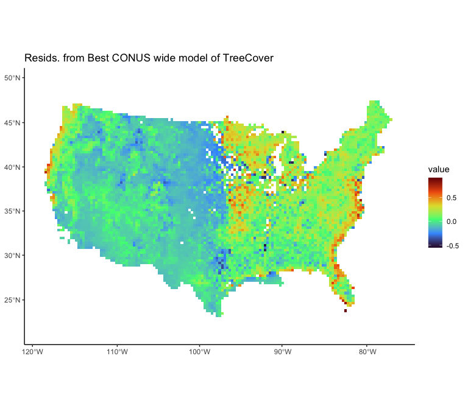
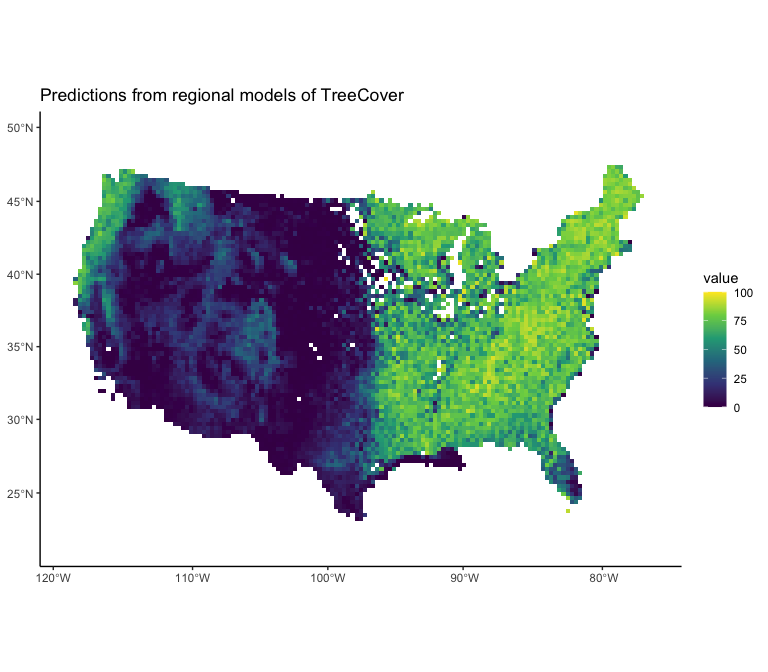
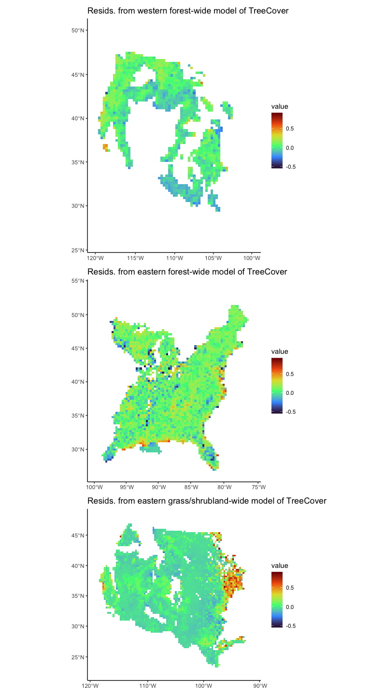
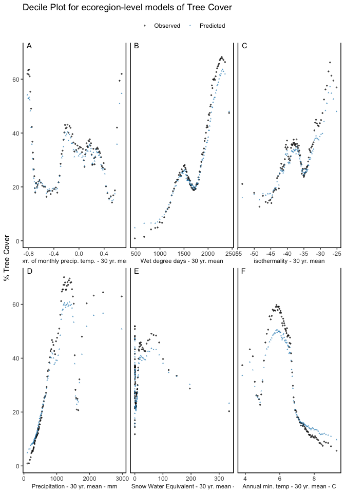
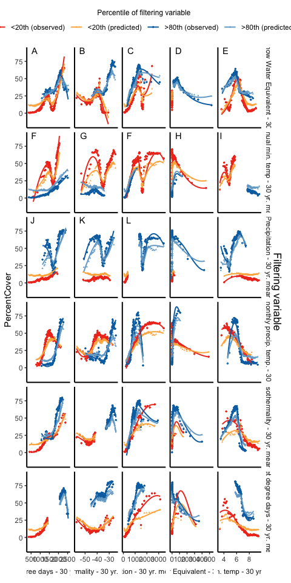
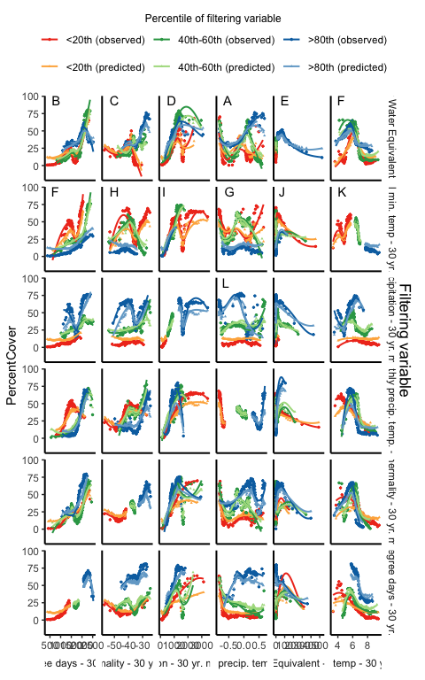

The data consists of vegetation % cover by functional group from across CONUS (from AIM, FIA, LANDFIRE, and RAP), 
as well as climate variables from DayMet, which have been aggregated into mean interannual conditions accross multiple temporal windows. 


# Dependencies 

User defined parameters


``` r
print(params)
```

```
## $test_run
## [1] FALSE
## 
## $save_figs
## [1] FALSE
## 
## $response
## [1] "TotalTreeCover_dec"
## 
## $hmod
## [1] FALSE
## 
## $s
## [1] "TreeCover"
## 
## $sample_group
## [1] 1
## 
## $byRegion
## [1] TRUE
```

``` r
# set to true if want to run for a limited number of rows (i.e. for code testing)
test_run <- params$test_run
save_figs <- params$save_figs
hmod <- params$hmod # whether to include human modification in the model
# by changing the sample_group the model can be fit to a completely different set of rows
sample_group <- params$sample_group 
response <- params$response
# _ann defines this model as being built on annual data
s <- params$s # string to paste to file names e.g., that defines the interactions in the model
# such as (summer ppt * MAT) and annuals*temperature interactions
fit_sample <- TRUE # fit model to a sample of the data
n_train <- 5e4 # sample size of the training data
n_test <- 1e6 # sample size of the testing data (if this is too big the decile dotplot code throws memory errors)
byRegion <- params$byRegion
```


``` r
# set option so resampled dataset created here reproduces earlier runs of this code with dplyr 1.0.10
source("../../../Functions/glmTransformsIterates.R")
source("../../../Functions/transformPreds.R")
source("../../../Functions/StepBeta_mine.R")
#source("src/fig_params.R")
#source("src/modeling_functions.R")

library(terra)
library(tidyterra)
library(sf)
library(caret)
library(betareg)
library(tidyverse)
library(GGally) # for ggpairs()
library(pdp) # for partial dependence plots
library(gridExtra)
library(knitr)
library(patchwork) # for figure insets etc. 
library(ggtext)
library(StepBeta)
theme_set(theme_classic())
```

# read in data

Data compiled in the `prepDataForModels.R` script


``` r
modDat <- readRDS("../../../data/DataForModels_withSubEcoreg.rds")
```


# Prep data


``` r
set.seed(1234)
modDat_1 <- modDat %>% 
  mutate(Lon = st_coordinates(.)[,1], 
         Lat = st_coordinates(.)[,2])  %>% 
  st_drop_geometry() %>% 
  filter(!is.na(newRegion))

# small dataset for if testing the data
if(test_run) {
  modDat_1 <- slice_sample(modDat_1, n = 1e5)
}
```


For now, not doing any resampling


``` r
set.seed(1234)

pred_vars <- c("swe_meanAnnAvg_30yr", "tmean_meanAnnAvg_30yr", "prcp_meanAnnTotal_30yr", "PrecipTempCorr_meanAnnAvg_30yr", "isothermality_meanAnnAvg_30yr", "annWetDegDays_meanAnnAvg_30yr")
# removed VPD, since it's highly correlated w/ tmean and prcp

names(pred_vars) <- pred_vars

# predictor vars are the same in both dfs

## remove rows for data that have NAs in the predictors (lag starts before range of DayMet data)

modDat_1 <- modDat_1 %>% 
  drop_na(swe_meanAnnAvg_30yr, tmean_meanAnnAvg_30yr, prcp_meanAnnTotal_30yr, 
          precip_Seasonality_meanAnnAvg_30yr, PrecipTempCorr_meanAnnAvg_30yr, 
          isothermality_meanAnnAvg_30yr, all_of(response))
  

df_pred <- modDat_1[, pred_vars]
```

Break the data into three groups for model fitting based on lumped ecoregions


``` r
if (byRegion == TRUE) {
  modDat_westForest <- modDat_1 %>% 
  filter(newRegion == "westForest")
  
  modDat_eastForest <- modDat_1 %>% 
  filter(newRegion == "eastForest")
  
  modDat_shrubGrass <- modDat_1 %>% 
  filter(newRegion == "dryShrubGrass")
}
```

Training data


``` r
if (byRegion == TRUE) {
  ## for western forests
  wf_sample <- if(fit_sample & !test_run) {
  reordered <- slice_sample(modDat_westForest, prop = 1)
  
  low <- (sample_group - 1)*n_train + 1 # first row (of reordered data) to get
  high <- low + n_train - 1 # last row
  if(high > nrow(modDat_westForest)) {
    warning(paste0("n_train size due to low sample size (i.e. < ", n_train,")"))
    n_train <- n_train*.8
     low <- (sample_group - 1)*n_train + 1 # first row (of reordered data) to get
  high <- low + n_train - 1 # last row
   #stop('trying to sample from rows that dont exist')
  }
  reordered[low:high, ]
} else {
    modDat_westForest
}

wf_test <- if(fit_sample & !test_run & 
              # antijoin only works if there are enough rows that meet 
              # that criterion, i.e. if wf_sample contains most of the data i
              # doesnt' work
              (nrow(modDat_westForest) - nrow(wf_sample) > n_test)) {
  modDat_westForest %>% 
    anti_join(wf_sample, by = c("cell_num", "year")) %>% 
    slice_sample(n = n_test)
} else {
  modDat_westForest %>% 
    slice_sample(n = n_test)
}

# small sample for certain plots
wf_small <- slice_sample(modDat_westForest, n = 1e5)

# for eastern forests
ef_sample <- if(fit_sample & !test_run) {
  reordered <- slice_sample(modDat_eastForest, prop = 1)
  
  low <- (sample_group - 1)*n_train + 1 # first row (of reordered data) to get
  high <- low + n_train - 1 # last row
  if(high > nrow(modDat_eastForest)) {
    warning(paste0("n_train size due to low sample size (i.e. < ", n_train,")"))
    n_train <- n_train*.8
     low <- (sample_group - 1)*n_train + 1 # first row (of reordered data) to get
  high <- low + n_train - 1 # last row
   #stop('trying to sample from rows that dont exist')
  }
  reordered[low:high, ]
} else {
    modDat_eastForest
}

ef_test <- if(fit_sample & !test_run & 
              # antijoin only works if there are enough rows that meet 
              # that criterion, i.e. if ef_sample contains most of the data i
              # doesnt' work
              (nrow(modDat_eastForest) - nrow(ef_sample) > n_test)) {
  modDat_eastForest %>% 
    anti_join(ef_sample, by = c("cell_num", "year")) %>% 
    slice_sample(n = n_test)
} else {
  modDat_eastForest %>% 
    slice_sample(n = n_test)
}

# small sample for certain plots
ef_small <- slice_sample(modDat_eastForest, n = 1e5)

## for grass/shrubs
g_sample <- if(fit_sample & !test_run) {
  reordered <- slice_sample(modDat_shrubGrass, prop = 1)
  
  low <- (sample_group - 1)*n_train + 1 # first row (of reordered data) to get
  high <- low + n_train - 1 # last row
  if(high > nrow(modDat_shrubGrass)) {
    warning(paste0("n_train size due to low sample size (i.e. < ", n_train,")"))
    n_train <- n_train*.8
     low <- (sample_group - 1)*n_train + 1 # first row (of reordered data) to get
  high <- low + n_train - 1 # last row
   #stop('trying to sample from rows that dont exist')
  }
  reordered[low:high, ]
} else {
    modDat_shrubGrass
}

g_test <- if(fit_sample & !test_run & 
              # antijoin only works if there are enough rows that meet 
              # that criterion, i.e. if g_sample contains most of the data i
              # doesnt' work
              (nrow(modDat_shrubGrass) - nrow(g_sample) > n_test)) {
  modDat_shrubGrass %>% 
    anti_join(g_sample, by = c("cell_num", "year")) %>% 
    slice_sample(n = n_test)
} else {
  modDat_shrubGrass %>% 
    slice_sample(n = n_test)
}

# small sample for certain plots
g_small <- slice_sample(modDat_shrubGrass, n = 1e5)

## do full dataset as well 
df_sample <- if(fit_sample & !test_run) {
  reordered <- slice_sample(modDat_1, prop = 1)
  
  low <- (sample_group - 1)*n_train + 1 # first row (of reordered data) to get
  high <- low + n_train - 1 # last row
  if(high > nrow(modDat_1)) {
    warning(paste0("n_train size due to low sample size (i.e. < ", n_train,")"))
    n_train <- n_train*.8
     low <- (sample_group - 1)*n_train + 1 # first row (of reordered data) to get
  high <- low + n_train - 1 # last row
   #stop('trying to sample from rows that dont exist')
  }
  reordered[low:high, ]
} else {
    modDat_1
}

df_test <- if(fit_sample & !test_run & 
              # antijoin only works if there are enough rows that meet 
              # that criterion, i.e. if df_sample contains most of the data i
              # doesnt' work
              (nrow(modDat_1) - nrow(df_sample) > n_test)) {
  modDat_1 %>% 
    anti_join(df_sample, by = c("cell_num", "year")) %>% 
    slice_sample(n = n_test)
} else {
  modDat_1 %>% 
    slice_sample(n = n_test)
}

# small sample for certain plots
df_small <- slice_sample(modDat_1, n = 1e5)

} else  if (byRegion == FALSE) {
  
  df_sample <- if(fit_sample & !test_run) {
  reordered <- slice_sample(modDat_1, prop = 1)
  
  low <- (sample_group - 1)*n_train + 1 # first row (of reordered data) to get
  high <- low + n_train - 1 # last row
  if(high > nrow(modDat_1)) {
    warning(paste0("n_train size due to low sample size (i.e. < ", n_train,")"))
    n_train <- n_train*.8
     low <- (sample_group - 1)*n_train + 1 # first row (of reordered data) to get
  high <- low + n_train - 1 # last row
   #stop('trying to sample from rows that dont exist')
  }
  reordered[low:high, ]
} else {
    modDat_1
}

df_test <- if(fit_sample & !test_run & 
              # antijoin only works if there are enough rows that meet 
              # that criterion, i.e. if df_sample contains most of the data i
              # doesnt' work
              (nrow(modDat_1) - nrow(df_sample) > n_test)) {
  modDat_1 %>% 
    anti_join(df_sample, by = c("cell_num", "year")) %>% 
    slice_sample(n = n_test)
} else {
  modDat_1 %>% 
    slice_sample(n = n_test)
}

# small sample for certain plots
df_small <- slice_sample(modDat_1, n = 1e5)
}
```


## Plot predictor vars against each other

<!-- here using pred dataframe, because smaller and this code is slow.  -->

<!-- ```{r pred_v_pred} -->
<!-- df_pred %>%  -->
<!--   filter() -->
<!--   slice_sample(n = 5e4) %>%  -->
<!--   #select(-matches("_")) %>%  -->
<!-- ggpairs(lower = list(continuous = GGally::wrap("points", alpha = 0.1, size=0.2)),  -->
<!--         columnLabels = c("swe", "tmean", "prcp", "prcpTempCorr", "isothermality", "wetDegDays")) -->

<!-- ``` -->


# GLM
# get the best GLM from the previous model run 

``` r
mod_glmFinal <- readRDS("./models/glm_beta_model_CONUSwide_TotalTreeCover_n50000.RDS")

if (byRegion == TRUE) {
  mod_glmFinal_EF <- readRDS("./models/glm_beta_model_EasternForests_TotalTreeCover_n50000.RDS")
mod_glmFinal_WF <- readRDS("./models/glm_beta_model_WesternForests_TotalTreeCover_n50000.RDS")
mod_glmFinal_G <- readRDS("./models/glm_beta_model_GrassShrub_TotalTreeCover_n50000.RDS")

}
```


## partial dependence & VIP

PDP plot trend made using a small sample of the data


``` r
#vip::vip(mod_glmFinal, num_features = 15)

#pdp_all_vars(mod_glmFinal, mod_vars = pred_vars, ylab = 'probability',train = df_small)

#caret::varImp(mod_glmFinal)
```


## observed vs. predicted

Predicting on the data


``` r
  # create prediction for each each model
# (i.e. for each fire proporation variable)
predict_by_response <- function(mod, df) {
  df_out <- df

  response_name <- paste0(response, "_pred")
  df_out[[response_name]] <- predict(mod, df, type = 'response')
  df_out
}

pred_glm1 <- predict_by_response(mod_glmFinal, df_test)


if (byRegion == TRUE) {
  ## western forests
  # create prediction 
  pred_glm1_WF <- predict_by_response(mod_glmFinal_WF, wf_test)
  
  ## eastern forests
  # create prediction 
  pred_glm1_EF <- predict_by_response(mod_glmFinal_EF, ef_test)
  
  ## grass/shrub
  # create prediction 
  pred_glm1_G <- predict_by_response(mod_glmFinal_G, g_test)
  
  ## add predictions together for later figures
  pred_glm1_ALL <- rbind(pred_glm1_WF, pred_glm1_EF, pred_glm1_G)
}
```

### Maps of Residuals
For CONUS-wide model

``` r
pred_glm1 <- pred_glm1 %>% 
  mutate(resid = .[[response]] - .[[paste0(response,"_pred")]]) 

# rasterize
# get reference raster
test_rast <-  rast("../../../data/dayMet/rawMonthlyData/orders/70e0da02b9d2d6e8faa8c97d211f3546/Daymet_Monthly_V4R1/data/daymet_v4_prcp_monttl_na_1980.tif") %>% 
  terra::aggregate(fact = 32, fun = "mean")

# rasterize data
plotResid_rast <- pred_glm1 %>% 
         drop_na(resid) %>% 
  #slice_sample(n = 5e4) %>%
  terra::vect(geom = c("Lon", "Lat")) %>% 
  terra::set.crs(crs(test_rast)) %>% 
  terra::rasterize(y = test_rast, 
                   field = "resid", 
                   fun = mean) %>% 
  terra::crop(ext(-2000000, 2500000, -2000000, 1200000))
# plot
ggplot() + 
  geom_spatraster(data = plotResid_rast) + 
  ggtitle(paste0("Resids. from Best CONUS wide model of ",s)) + 
  scale_fill_viridis_c(option = "turbo", limits = c(-.55, .91), na.value = "white")
```

<!-- -->

``` r
# terra::plot(plotResid_rast, main = paste0("Resids. from Best CONUS wide model of ",s), clip = TRUE, 
#             plg = list(title = "resid."), 
#             col = map.pal("curvature"))
```

If applicable, residual plots of region-level models

``` r
if (byRegion == TRUE){
pred_glm1_ALL <- pred_glm1_ALL %>% 
  mutate(resid = .[[response]] - .[[paste0(response,"_pred")]]) 

# get ecoregion boundaries 
#ecoReg <- readRDS("../../../data/ecoRegionExtents.RDS")
# rasterize data
plotResid_rast_ALL <- pred_glm1_ALL %>% 
         drop_na(resid) %>% 
  #slice_sample(n = 5e4) %>%
  terra::vect(geom = c("Lon", "Lat")) %>% 
  terra::set.crs(crs(test_rast)) %>% 
  terra::rasterize(y = test_rast, 
                   field = "resid", 
                   fun = mean) %>% 
  terra::crop(ext(-2000000, 2500000, -2000000, 1200000))
# plot

(residMap_allTrees <- ggplot() + 
  geom_spatraster(data = plotResid_rast_ALL) + 
  ggtitle(paste0("Resids. from regional models of ",s)) + 
  scale_fill_viridis_c(option = "turbo", limits = c(-.55, .91), na.value = "white", 
                       ) )#+ 


## plot predictions
plotPreds_rast_ALL <- pred_glm1_ALL %>% 
         drop_na(TotalTreeCover_dec) %>% 
  #slice_sample(n = 5e4) %>%
  terra::vect(geom = c("Lon", "Lat")) %>% 
  terra::set.crs(crs(test_rast)) %>% 
  terra::rasterize(y = test_rast, 
                   field = "TotalTreeCover_dec", 
                   fun = mean) %>% 
  terra::crop(ext(-2000000, 2500000, -2000000, 1200000))

(predsMap_allTrees <- ggplot() + 
  geom_spatraster(data = plotPreds_rast_ALL*100) + 
  ggtitle(paste0("Predictions from regional models of ",s)) + 
  scale_fill_viridis_c(option = "viridis", limits = c(0, 100), na.value = "white", 
                       )) #+ 1

}
```

<!-- -->


``` r
if (byRegion == TRUE){
## for western forests
  pred_glm1_WF <- pred_glm1_WF %>% 
  mutate(resid = .[[response]] - .[[paste0(response,"_pred")]]) 

# rasterize

# rasterize data
plotResid_rast_WF <- pred_glm1_WF %>% 
         drop_na(resid) %>% 
  #slice_sample(n = 5e4) %>%
  terra::vect(geom = c("Lon", "Lat")) %>% 
  terra::set.crs(crs(test_rast)) %>% 
  terra::rasterize(y = test_rast, 
                   field = "resid", 
                   fun = mean) %>% 
  terra::crop(ext(-2000000, 0, -1500000, 1200000))
westForestRast <- ggplot() + 
  geom_spatraster(data = plotResid_rast_WF) + 
  ggtitle(paste0("Resids. from western forest-wide model of ",s)) + 
  scale_fill_viridis_c(option = "turbo", limits = c(-.55, .91), na.value = "white") 

## for eastern forests
  pred_glm1_EF <- pred_glm1_EF %>% 
  mutate(resid = .[[response]] - .[[paste0(response,"_pred")]]) 

# rasterize data
plotResid_rast_EF <- pred_glm1_EF %>% 
         drop_na(resid) %>% 
  #slice_sample(n = 5e4) %>%
  terra::vect(geom = c("Lon", "Lat")) %>% 
  terra::set.crs(crs(test_rast)) %>% 
  terra::rasterize(y = test_rast, 
                   field = "resid", 
                   fun = mean) %>% 
  terra::crop(ext(0, 2500000, -1700000, 1200000))

EastForestRast <- ggplot() + 
  geom_spatraster(data = plotResid_rast_EF) + 
  ggtitle(paste0("Resids. from eastern forest-wide model of ",s)) + 
  scale_fill_viridis_c(option = "turbo", limits = c(-.55, .91), na.value = "white") 

## for shrub/grassland
  pred_glm1_G <- pred_glm1_G %>% 
  mutate(resid = .[[response]] - .[[paste0(response,"_pred")]]) 

# rasterize data
plotResid_rast_G <- pred_glm1_G %>% 
         drop_na(resid) %>% 
  #slice_sample(n = 5e4) %>%
  terra::vect(geom = c("Lon", "Lat")) %>% 
  terra::set.crs(crs(test_rast)) %>% 
  terra::rasterize(y = test_rast, 
                   field = "resid", 
                   fun = mean) %>% 
  terra::crop(ext(-2000000, 900000, -1900000, 1000000))
grassRast <- ggplot() + 
  geom_spatraster(data = plotResid_rast_G) + 
  ggtitle(paste0("Resids. from eastern grass/shrubland-wide model of ",s)) + 
  scale_fill_viridis_c(option = "turbo", limits = c(-.55, .91), na.value = "white") 

westForestRast / EastForestRast / grassRast
}
```

<!-- -->

### Deciles

Binning predictor variables into deciles (actually percentiles) and looking at the mean
predicted probability for each percentile. The use of the word deciles
is just a legacy thing (they started out being actual deciles)

Then predicting on an identical dataset but with warming


``` r
var_prop_pred <- paste0(response, "_pred")
response_vars <- c(response, var_prop_pred)

pred_glm1_deciles <- predvars2deciles(pred_glm1,
                                      response_vars = response_vars,
                                      pred_vars = pred_vars)

if (byRegion == TRUE) {
  ## western forests
  pred_glm1_deciles_WF <- predvars2deciles(pred_glm1_WF,
                                      response_vars = response_vars,
                                      pred_vars = pred_vars) %>% 
    mutate(newRegion = "westernForest")
  
    ## eastern forests
  pred_glm1_deciles_EF <- predvars2deciles(pred_glm1_EF,
                                      response_vars = response_vars,
                                      pred_vars = pred_vars) %>% 
    mutate(newRegion = "easternForest")
  
    ## grass/shrub
  pred_glm1_deciles_G <- predvars2deciles(pred_glm1_G,
                                      response_vars = response_vars,
                                      pred_vars = pred_vars) %>% 
    mutate(newRegion = "grassShrub")
  
  ## put together for later figures 
  pred_glm1_deciles_ALL <- predvars2deciles(pred_glm1_ALL,
                                      response_vars = response_vars,
                                      pred_vars = pred_vars)
}
```


Publication quality quantile plot


``` r
# publication quality version
g3 <- decile_dotplot_pq(pred_glm1_deciles, response = response) + ggtitle("Decile Plot for CONUS-wide model")

if(!hmod) {
# obs/pred inset
g4 <- add_dotplot_inset(g3, pred_glm1_deciles)
} else {
  g4 <- g3
}
if (byRegion == FALSE){
  g4
}

  
if(save_figs) {
  png(paste0("figures/quantile_plots/quantile_plot_v5_CONUS_wideModel_", s,  ".png"), 
     units = "in", res = 600, width = 5.5, height = 3.5 )
    print(g2)
  dev.off()
}
if (byRegion == TRUE) {

  # publication quality version
g2 <- decile_dotplot_pq(pred_glm1_deciles_ALL, response = response) + ggtitle("Decile Plot for ecoregion-level models of Tree Cover")

if(save_figs) {
  png(paste0("figures/quantile_plots/quantile_plot_v5_regionLevelModel", s,  ".png"), 
     units = "in", res = 600, width = 5.5, height = 3.5 )
    print(g2)
  dev.off()
}

g2 + ylab("% Tree Cover")
}
```

<!-- -->

### Deciles Filtered 

20th and 80th percentiles for each climate variable


``` r
df <- pred_glm1[, pred_vars] #%>% 
  #mutate(MAT = MAT - 273.15) # k to c
map(df, quantile, probs = c(0.2, 0.8), na.rm = TRUE)
```

```
## $swe_meanAnnAvg_30yr
##         20%         80% 
##  0.01980877 18.90127994 
## 
## $tmean_meanAnnAvg_30yr
##      20%      80% 
## 5.713208 7.706500 
## 
## $prcp_meanAnnTotal_30yr
##      20%      80% 
##  364.622 1337.371 
## 
## $PrecipTempCorr_meanAnnAvg_30yr
##        20%        80% 
## -0.6380655  0.2866302 
## 
## $isothermality_meanAnnAvg_30yr
##       20%       80% 
## -41.70132 -32.67548 
## 
## $annWetDegDays_meanAnnAvg_30yr
##      20%      80% 
## 1400.790 2073.257
```


Filtered 'Decile' plots of data. These plots show each vegetation variable,
but only based on data that falls into the upper and lower two deciles of
each climate variable. 


``` r
clim_vars <- c("swe_meanAnnAvg_30yr", "tmean_meanAnnAvg_30yr", "prcp_meanAnnTotal_30yr", "precip_Seasonality_meanAnnAvg_30yr", "isothermality_meanAnnAvg_30yr", "annWetDegDays_meanAnnAvg_30yr")
pred_glm1_deciles_filt <- predvars2deciles( pred_glm1, 
                         response_vars = response_vars,
                         pred_vars = pred_vars,
                         filter_var = TRUE,
                         filter_vars = pred_vars) 

decile_dotplot_filtered_pq(pred_glm1_deciles_filt, xvars = clim_vars)
```

<!-- -->

``` r
#decile_dotplot_filtered_pq(pred_glm1_deciles_filt)
```


Filtered quantile figure with middle 2 deciles also shown
(this is very memory intensive so no running at the moment)


``` r
pred_glm1_deciles_filt_mid <- predvars2deciles(pred_glm1, 
                         response_vars = response_vars,
                         pred_vars = pred_vars,
                         filter_vars = pred_vars,
                         filter_var = TRUE,
                         add_mid = TRUE)

g <- decile_dotplot_filtered_pq(df = pred_glm1_deciles_filt_mid, xvars = pred_vars)
g
```

<!-- -->

``` r
if(save_figs) {x
jpeg(paste0("figures/quantile_plots/quantile_plot_filtered_mid_v1", s, ".jpeg"),
     units = "in", res = 600, width = 5.5, height = 6 )
  g 
dev.off()
}
```


# session info

Hash of current commit (i.e. to ID the version of the code used)


``` r
system("git rev-parse HEAD", intern=TRUE)
```

```
## [1] "aba84d0b9e17afcd4d26d2587b03dfd075f24f6f"
```

Packages etc.


``` r
sessionInfo()
```

```
## R version 4.4.0 (2024-04-24)
## Platform: aarch64-apple-darwin20
## Running under: macOS Sonoma 14.4.1
## 
## Matrix products: default
## BLAS:   /Library/Frameworks/R.framework/Versions/4.4-arm64/Resources/lib/libRblas.0.dylib 
## LAPACK: /Library/Frameworks/R.framework/Versions/4.4-arm64/Resources/lib/libRlapack.dylib;  LAPACK version 3.12.0
## 
## locale:
## [1] en_US.UTF-8/en_US.UTF-8/en_US.UTF-8/C/en_US.UTF-8/en_US.UTF-8
## 
## time zone: America/Denver
## tzcode source: internal
## 
## attached base packages:
## [1] stats     graphics  grDevices utils     datasets  methods   base     
## 
## other attached packages:
##  [1] StepBeta_2.1.0  ggtext_0.1.2    knitr_1.46      gridExtra_2.3  
##  [5] pdp_0.8.1       GGally_2.2.1    lubridate_1.9.3 forcats_1.0.0  
##  [9] dplyr_1.1.4     purrr_1.0.2     readr_2.1.5     tidyr_1.3.1    
## [13] tibble_3.2.1    tidyverse_2.0.0 betareg_3.1-4   caret_6.0-94   
## [17] lattice_0.22-6  ggplot2_3.5.1   sf_1.0-16       tidyterra_0.6.1
## [21] terra_1.7-78    dtplyr_1.3.1    patchwork_1.2.0 stringr_1.5.1  
## 
## loaded via a namespace (and not attached):
##  [1] DBI_1.2.3            pROC_1.18.5          sandwich_3.1-0      
##  [4] rlang_1.1.4          magrittr_2.0.3       e1071_1.7-14        
##  [7] compiler_4.4.0       mgcv_1.9-1           flexmix_2.3-19      
## [10] vctrs_0.6.5          reshape2_1.4.4       combinat_0.0-8      
## [13] pkgconfig_2.0.3      fastmap_1.2.0        labeling_0.4.3      
## [16] utf8_1.2.4           rmarkdown_2.27       markdown_1.13       
## [19] prodlim_2024.06.25   tzdb_0.4.0           xfun_0.44           
## [22] modeltools_0.2-23    cachem_1.1.0         jsonlite_1.8.8      
## [25] recipes_1.1.0        highr_0.10           parallel_4.4.0      
## [28] R6_2.5.1             bslib_0.7.0          stringi_1.8.4       
## [31] RColorBrewer_1.1-3   parallelly_1.37.1    rpart_4.1.23        
## [34] lmtest_0.9-40        jquerylib_0.1.4      Rcpp_1.0.12         
## [37] iterators_1.0.14     future.apply_1.11.2  zoo_1.8-12          
## [40] Matrix_1.7-0         splines_4.4.0        nnet_7.3-19         
## [43] timechange_0.3.0     tidyselect_1.2.1     rstudioapi_0.16.0   
## [46] yaml_2.3.8           timeDate_4032.109    codetools_0.2-20    
## [49] listenv_0.9.1        plyr_1.8.9           withr_3.0.0         
## [52] evaluate_0.23        future_1.33.2        survival_3.5-8      
## [55] ggstats_0.6.0        units_0.8-5          proxy_0.4-27        
## [58] xml2_1.3.6           pillar_1.9.0         KernSmooth_2.23-22  
## [61] foreach_1.5.2        stats4_4.4.0         generics_0.1.3      
## [64] hms_1.1.3            commonmark_1.9.1     aod_1.3.3           
## [67] munsell_0.5.1        scales_1.3.0         globals_0.16.3      
## [70] class_7.3-22         glue_1.7.0           tools_4.4.0         
## [73] data.table_1.15.4    ModelMetrics_1.2.2.2 gower_1.0.1         
## [76] grid_4.4.0           ipred_0.9-15         colorspace_2.1-0    
## [79] nlme_3.1-164         Formula_1.2-5        cli_3.6.2           
## [82] fansi_1.0.6          viridisLite_0.4.2    lava_1.8.0          
## [85] gtable_0.3.5         sass_0.4.9           digest_0.6.35       
## [88] classInt_0.4-10      farver_2.1.2         htmltools_0.5.8.1   
## [91] lifecycle_1.0.4      hardhat_1.4.0        gridtext_0.1.5      
## [94] MASS_7.3-60.2
```
